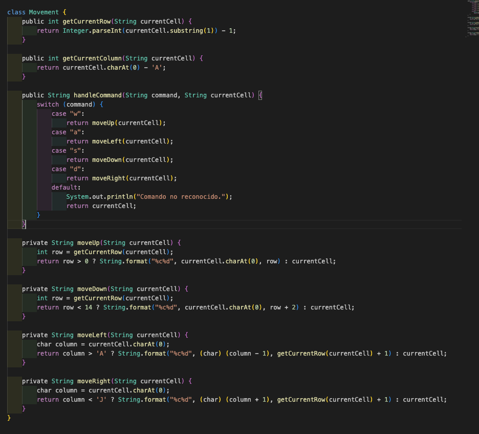

# Clase Navegador
***¿Por Que?***

Esta clase en temas de programación modular tiene cierto acoplamiento con la clase Settings, ya que esta última le inyecta algunas constantes. También presenta una cohesión moderada con los demás módulos, como se puede observar en los métodos [getFormattedRow](https://github.com/pablarce/23-24-IdSw2-SDD/blob/9bb3ba620abd97635bd97d2da741642bc47f5f8b/pyHojaDeCalculo/Utils/Controller/Navigator.java#L4) y [getFormattedColumn](https://github.com/pablarce/23-24-IdSw2-SDD/blob/9bb3ba620abd97635bd97d2da741642bc47f5f8b/pyHojaDeCalculo/Utils/Controller/Navigator.java#L8). Ambos métodos se centran en transformar la posición de una celda desde su formato de cadena de índices de fila y columna, lo que les otorga una responsabilidad definida y relacionada.

Además, los métodos de movimiento como [moveUp, moveDown, moveLeft, moveRight](https://github.com/pablarce/23-24-IdSw2-SDD/blob/9bb3ba620abd97635bd97d2da741642bc47f5f8b/pyHojaDeCalculo/Utils/Controller/Navigator.java#L28) tienen una alta cohesión, ya que todos se centran en calcular las nuevas posiciones de celdas basándose en la posición actual y una dirección de movimiento específica. En términos de encapsulamiento, la clase es exitosa y muestra una considerable escalabilidad. En relación con los principios SOLID, esta clase cumple con la S (Single Responsibility Principle) y la I (Interface Segregation Principle), ya que se encarga exclusivamente del movimiento en la hoja de cálculo y no depende de otras interfaces. 

***Que Cambiamos***

# Clase Settings
***¿Por Que?***

La clase Settings exhibe bajo acoplamiento al no depender de otras clases, y alta cohesión al concentrarse exclusivamente en almacenar configuraciones estáticas. Es altamente reutilizable para cualquier proyecto con necesidades similares de configuración. Cumple parcialmente con el principio S (Single Responsibility Principle) de SOLID, dado que su responsabilidad principal es la gestión de configuraciones estáticas. Sin embargo, incluye la función [getMaxColumns](https://github.com/pablarce/23-24-IdSw2-SDD/blob/721a9f57351b5304017dbe8d2ee7a7e2ea8bf0fd/pyHojaDeCalculo/Utils/Controller/Settings.java#L12), la cual permanece en esta clase debido a su importancia crítica para ciertas operaciones del proyecto. Moverla a otra clase podría comprometer parcialmente este principio. Otra solución sería crear una nueva clase para esta función, pero podría resultar en una estructura demasiado fragmentada y dificultar la legibilidad del código.

***Que Cambiamos***

La clase Movement se creo para el movimiento entre las filas y columnas pero esta clase estaba ajustada al indice restando 1, movement no ajustaba el indice de la fila correctamente para el movimimiento hacia arriba, como se puede observar:, pero se creo una clase navigator que fue diseñada para obtener directamente la fila del inidice del string, cuando se una el movimineto hacia arriba ajusta la fila decrementando en 1, siempre y cuando la fila sea mayor a 0, navigator tiene una implemntacion mas flexible utilizando constantes para definir los límites y manejando el movimiento de una manera más lógica y precisa (https://github.com/pablarce/23-24-IdSw2-SDD/blob/main/pyHojaDeCalculo/Utils/Controller/Navigator.java)