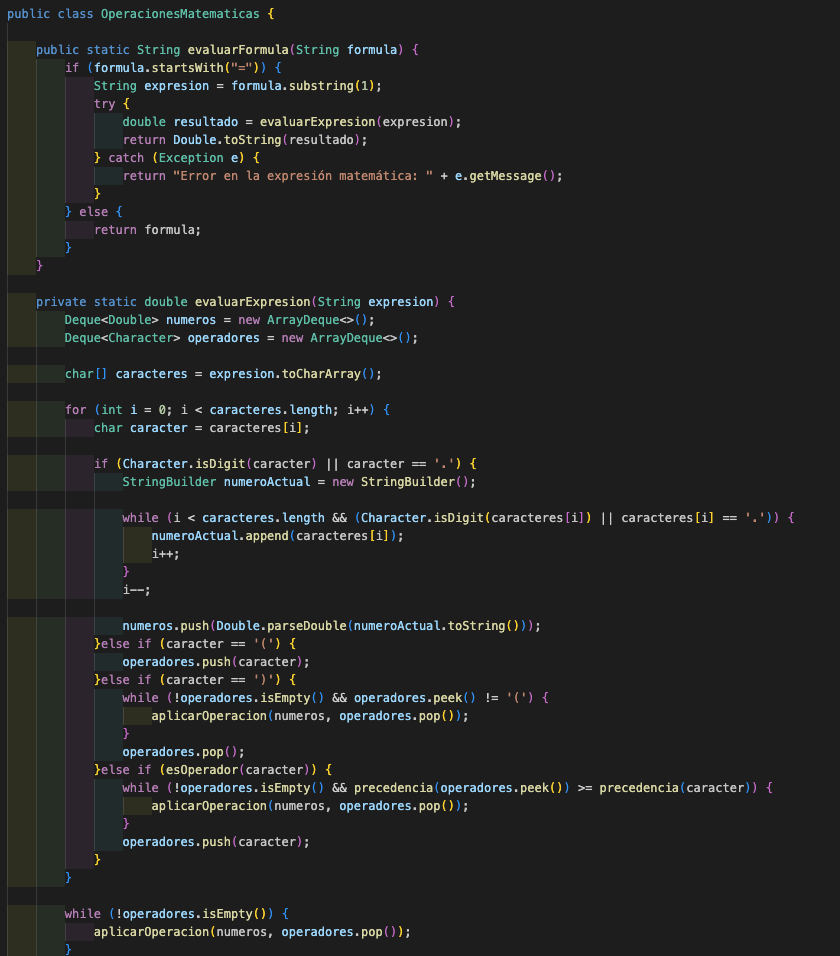
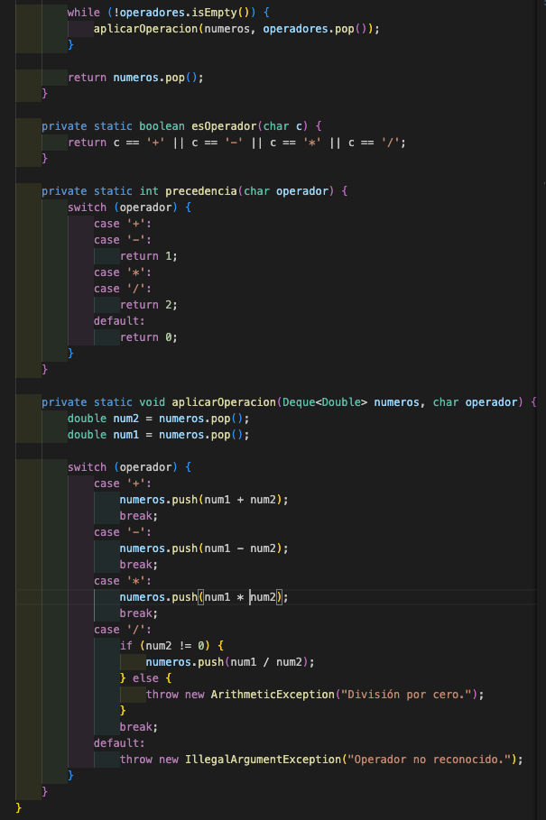
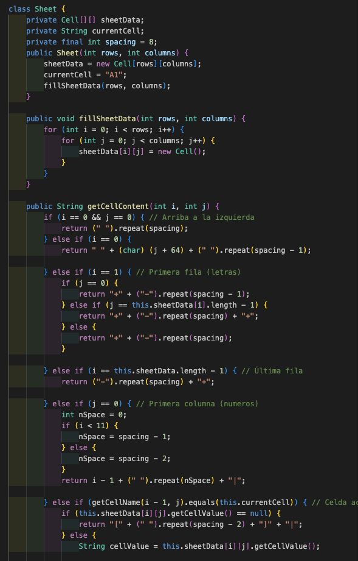

# Clase MathOperations
***¿Por Que?***

La clase MathOperations muestra una moderada cohesión y acoplamiento. Depende de la clase Sheet, y el método [getCellValue](https://github.com/pablarce/23-24-IdSw2-SDD/blob/fead6900c7c9dcd2f1063ecd556f2c7d42b19b14/pyHojaDeCalculo/Utils/Model/MathOperations.java#L74) está acoplado a la implementación específica de Sheet. Su enfoque principal es la evaluación de fórmulas matemáticas simples, esto se evidencia en los métodos [evaluateFormula](https://github.com/pablarce/23-24-IdSw2-SDD/blob/fead6900c7c9dcd2f1063ecd556f2c7d42b19b14/pyHojaDeCalculo/Utils/Model/MathOperations.java#L8), [evaluateExpression](https://github.com/pablarce/23-24-IdSw2-SDD/blob/fead6900c7c9dcd2f1063ecd556f2c7d42b19b14/pyHojaDeCalculo/Utils/Model/MathOperations.java#L22) y en los métodos privados [isOperator, precedence y applyOperation](https://github.com/pablarce/23-24-IdSw2-SDD/blob/fead6900c7c9dcd2f1063ecd556f2c7d42b19b14/pyHojaDeCalculo/Utils/Model/MathOperations.java#L85). Todos estos métodos comparten una responsabilidad unificada, ya que colaboran para encontrar el resultado de una fórmula matemática. Además, es escalable, ya que la adición de nuevas operaciones solo requiere insertar otro caso en un switch junto con la lógica de cálculo correspondiente.

Cumple con el principio S (Single Responsibility Principle) al concentrarse principalmente en el cálculo de operaciones matemáticas simples. Sin embargo, el método [getCellValue](https://github.com/pablarce/23-24-IdSw2-SDD/blob/fead6900c7c9dcd2f1063ecd556f2c7d42b19b14/pyHojaDeCalculo/Utils/Model/MathOperations.java#L74) podría ser considerado una responsabilidad adicional que podría comprometer parcialmente este principio, aunque su uso se limita a esta clase y su extracción podría fragmentar el proyecto. Además, la clase es parcialmente compatible con el principio O (Open/Closed Principle), ya que está abierta a la extensión mediante la adición de nuevos operadores.

***Que Cambiamos***

# Clase Sheet
***¿Por Que?***

Esta clase presenta un bajo acoplamiento y una moderada cohesión. La clase Sheet maneja su lógica interna y no depende directamente de otras clases más allá de Settings. Su cohesión es moderada porque se enfoca en la gestión y manipulación de los datos de la hoja de cálculo, como se observa en métodos como [fillSheetData](https://github.com/pablarce/23-24-IdSw2-SDD/blob/fead6900c7c9dcd2f1063ecd556f2c7d42b19b14/pyHojaDeCalculo/Utils/Model/Sheet.java#L16), [getCellContent](https://github.com/pablarce/23-24-IdSw2-SDD/blob/fead6900c7c9dcd2f1063ecd556f2c7d42b19b14/pyHojaDeCalculo/Utils/Model/Sheet.java#L24) y [setCellValue](https://github.com/pablarce/23-24-IdSw2-SDD/blob/fead6900c7c9dcd2f1063ecd556f2c7d42b19b14/pyHojaDeCalculo/Utils/Model/Sheet.java#L67), entre otros. Estos métodos tienen responsabilidades claramente definidas y trabajan de manera independiente pero coordinada para manipular y gestionar los datos de la hoja de cálculo de forma eficiente.

Además, Sheet cumple con varios principios SOLID de diseño de software. El principio L (Liskov Substitution Principle) se cumple al no tener subclases directas y al estar diseñada de manera que no requiere ser extendida directamente para añadir funcionalidad. Respecto al principio I (Interface Segregation Principle), la clase no implementa interfaces genéricas innecesarias, sino que proporciona métodos específicos que se enfocan claramente en procesar y gestionar los datos en la hoja de cálculo. Finalmente, sigue el principio S (Single Responsibility Principle) al dedicarse exclusivamente a la manipulación de datos de la hoja de cálculo, asegurando que cada método tenga una tarea específica y claramente definida para lograr su propósito principal de manera eficiente.

***Que Cambiamos***

# Clase Spreadsheet
***¿Por Que?***

La clase Spreadsheets muestra un alto acoplamiento debido a su estrecha dependencia de varias clases clave como Navigator, Settings, Viewport, MenuInterface y MathOperations. Estas dependencias son fundamentales porque Spreadsheets contiene la lógica central de la hoja de cálculo, siendo responsable de coordinar y ejecutar todas las operaciones principales que se realizan en la aplicación. Un ejemplo concreto se observa al querer cambiar el valor de una celda, como se evidencia en las líneas [38 a 40](https://github.com/pablarce/23-24-IdSw2-SDD/blob/fead6900c7c9dcd2f1063ecd556f2c7d42b19b14/pyHojaDeCalculo/Utils/Model/Spreadsheet.java#L38). En este proceso, Spreadsheets transfiere la entrada del usuario a MathOperations, donde se realizan los cálculos pertinentes.

***Que Cambiamos***

En la clase Cell se diseño de esta manera:  para representar una celda simple sin coordenadas con una implementación más simple que solo almacena un valor de celda, sin considerar su posición, y en cambio en la nueva implentación se diseño para representar una celda con coordenadas útil para estructuras tipo matriz o tablero, los atributos 'x' y 'y' son para las coordenadas, que esta reflejado en este archivo (https://github.com/pablarce/23-24-IdSw2-SDD/blob/main/pyHojaDeCalculo/Utils/Model/Cell.java)

En la clase MathOperations se diseño con el fin de evaluar expresiones matemáticas sin referencias es decir que no manejaba referencias a celdas, solo numeros y operadores en la expresion como se puede observar ,, en la nueva implementación tiene un metodo en que toma una fórmula y un objeto sheet,  evalúa expresiones que pueden incluir referencias a celdas de una hoja de cálculo, utiliza un objeto Sheet para obtener valores de celdas referenciadas en la expresión que puede interpretar referencias a celdas (ej., A1) y obtener sus valores correspondientes (https://github.com/pablarce/23-24-IdSw2-SDD/blob/main/pyHojaDeCalculo/Utils/Model/MathOperations.java)

En la clase sheet se diseño mediante spacing que es un valor constante de 8, para poder a si llamar  al constructor Cell y muestra celdas seleccionadas con corchetes [] si es la celda actual. - Usa un tamaño de celda fijo definido por spacing, luego asigna el valor a una celda, ajustando las coordenadas dadas 'row + 2 y col + 1', como se muestra aca: ,, luego se ajusto a una manera que proporciona una estructura más ajustable y flexible en términos de tamaño de celdas y manejo de la posición actual de la celda, donde se asigna el valor a una celda directamente mediante las coordenadas dadas (https://github.com/pablarce/23-24-IdSw2-SDD/blob/main/pyHojaDeCalculo/Utils/Model/Sheet.java)