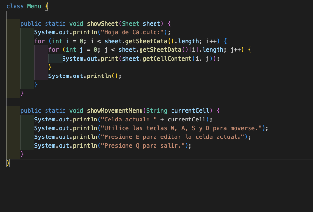

# Clase MenuInterface

***¿Por Qué?***

La clase `MenuInterface`, en términos de programación modular, tiene un bajo acoplamiento con otras clases, lo cual es positivo para la mantenibilidad y escalabilidad del sistema. La alta cohesión de la clase garantiza que todas sus responsabilidades están relacionadas y centradas en la tarea de mostrar un menú de movimientos. Además, cumple con el principio de responsabilidad única del diseño SOLID, al estar dedicada únicamente a la visualización del menú, y con el principio de segregación de interfaces, al no depender de métodos innecesarios.

A pesar de que la clase no está completamente cerrada para modificaciones, lo cual podría ser una mejora potencial en términos de adherencia al principio de abierto/cerrado (OCP), su diseño actual es adecuado para un sistema simple. Esto facilita la comprensión y el mantenimiento del código, permitiendo que la clase `MenuInterface` sea fácilmente modificable y extensible en el futuro.

***¿Que cambiamos?***

# Clase Viewport 

***¿Por Qué?***

Esta clase en términos de programación modular tiene cierto acoplamiento con la clase Settings, ya que depende de varias constantes definidas en ella. Presenta una cohesión moderada con otros módulos, como se observa en los métodos [showSheet](https://github.com/pablarce/23-24-IdSw2-SDD/blob/fead6900c7c9dcd2f1063ecd556f2c7d42b19b14/pyHojaDeCalculo/Utils/View/Viewport.java#L9), [printHeaders](https://github.com/pablarce/23-24-IdSw2-SDD/blob/fead6900c7c9dcd2f1063ecd556f2c7d42b19b14/pyHojaDeCalculo/Utils/View/Viewport.java#L32), [printIndex](https://github.com/pablarce/23-24-IdSw2-SDD/blob/fead6900c7c9dcd2f1063ecd556f2c7d42b19b14/pyHojaDeCalculo/Utils/View/Viewport.java#L45) y [printBottom](https://github.com/pablarce/23-24-IdSw2-SDD/blob/fead6900c7c9dcd2f1063ecd556f2c7d42b19b14/pyHojaDeCalculo/Utils/View/Viewport.java#L53). Estos métodos están bien definidos y encapsulados, centrándose en diferentes aspectos de la visualización de la hoja de cálculo, lo que les otorga una responsabilidad clara y relacionada.

Además, los métodos [printHeaders](https://github.com/pablarce/23-24-IdSw2-SDD/blob/fead6900c7c9dcd2f1063ecd556f2c7d42b19b14/pyHojaDeCalculo/Utils/View/Viewport.java#L32), [printIndex](https://github.com/pablarce/23-24-IdSw2-SDD/blob/fead6900c7c9dcd2f1063ecd556f2c7d42b19b14/pyHojaDeCalculo/Utils/View/Viewport.java#L45) y [printBottom](https://github.com/pablarce/23-24-IdSw2-SDD/blob/fead6900c7c9dcd2f1063ecd556f2c7d42b19b14/pyHojaDeCalculo/Utils/View/Viewport.java#L53) tienen una alta cohesión, ya que todos se centran en formatear y mostrar diferentes partes de la hoja de cálculo en la consola. En términos de encapsulamiento, la clase es exitosa y muestra una considerable escalabilidad.

En relación con los principios SOLID, esta clase cumple parcialmente con:S (Single Responsibility Principle): La clase se centra en la visualización, pero incluir la lógica de impresión en la misma clase podría violar este principio. Externalizar estos métodos mejoraría el cumplimiento de SRP, O (Open/Closed Principle): La clase no es fácilmente extensible sin modificar el código existente. Utilizar patrones de diseño como Strategy para la impresión podría mejorar el cumplimiento de este principio, D (Dependency Inversion Principle): La clase depende directamente de Settings, lo que podría mejorarse pasando configuraciones como parámetros, aumentando la flexibilidad y la testabilidad.

***¿Que cambiamos?***

La clase Menu fue diseñada para mostrar el menú de movimiento, también puede mostrar el contenido completo de la hoja de cálculo, como podemos observar: , pero en la nueva clase MenuInterface está más centrado en las interacciones de la vista, ya que proporciona una interfaz de menú para mover la celda actual y editarla, además de cambiar el tamaño de las celdas, (https://github.com/pablarce/23-24-IdSw2-SDD/blob/main/pyHojaDeCalculo/Utils/View/MenuInterface.java)